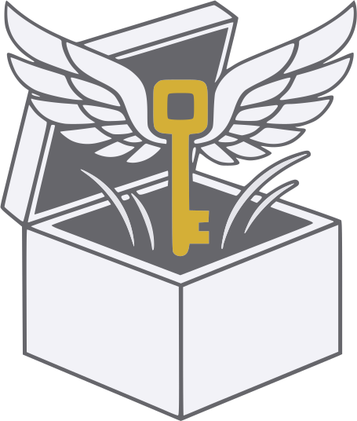

# freekee

<div align="center">
  <picture>
    <source media="(prefers-color-scheme: dark)" width="200" srcset="./docs/img/freekee-dark.svg">
    <source media="(prefers-color-scheme: light)" width="200" srcset="./docs/img/freekee-light.svg">
    
  </picture>
</div>

A CLI password manager built on standard KDBX4, compatible with KeePassXC, Strongbox, and KeePassDX. The added value is in tooling: ergonomic CLI, first-class credential rotation, and a security audit command.

> [!NOTE]
> This project is actively in development. Core read/write functionality works alongside existing KDBX clients, but some workflows have known gaps (see below).

## What works today

```sh
freekee init db.kdbx                          # create a new database
freekee ls db.kdbx                            # list entries
freekee get db.kdbx Personal/email            # show entry fields
freekee get db.kdbx Personal/email --show     # reveal password
freekee set db.kdbx Personal/email url=https://example.com
freekee set db.kdbx Personal/email --gen-password --print-generated
freekee history db.kdbx Personal/email        # show password history
freekee mv db.kdbx Personal/email Work/email
freekee rm db.kdbx Personal/email
freekee rotate passphrase db.kdbx
freekee rotate kdf-params db.kdbx --memory 128
freekee rotate entry db.kdbx Personal/email
freekee audit db.kdbx                         # check ciphers, KDF, entry strength
```

Every mutating command backs up the database before writing and rolls back on failure.

## Known gaps

- `set password=mysecret` exposes the value in shell history — a stdin input path is planned.
- Keyfile-protected databases can be read but not written yet.
- No clipboard integration, no default database config, no shell completions.

## Roadmap

Keyfile write support, safe password input for `set`, clipboard (`get --clip`), default database path config, shell completions, field-based search, bulk rotation, Tauri desktop/mobile UI.

## Building

```sh
cargo build --release
cargo test --workspace
```

Requires Rust 1.85+.

## Acknowledgements

Built on the shoulders of giants (non-exhaustive list):

- [keepass](https://keepass.info/download.html) - reference implementation
- [keepass-rs](https://github.com/sseemayer/keepass-rs)
- [keepassxc](https://github.com/keepassxreboot/keepassxc)

## License

Dual-licensed under MIT or Apache-2.0.
