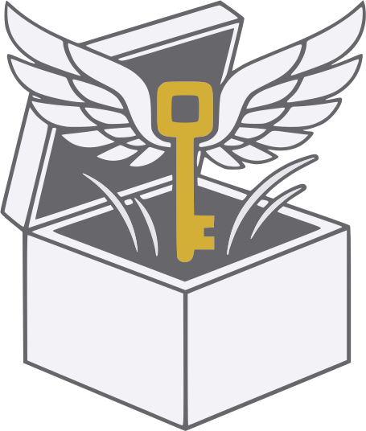

# freekee

<div align="center">
  <picture>
    <source media="(prefers-color-scheme: dark)" width="200" srcset="./docs/img/freekee-dark.svg">
    <source media="(prefers-color-scheme: light)" width="200" srcset="./docs/img/freekee-light.svg">
    
  </picture>
</div>

A CLI password manager built on standard KDBX4, compatible with KeePassXC, Strongbox, and KeePassDX. The added value is in tooling: ergonomic CLI, first-class credential rotation, and a security audit command.

> [!NOTE]
> This project is actively in development. Core read/write functionality works alongside existing KDBX clients, but some workflows have known gaps (see below).

## What works today

```sh
export FREEKEE_DB=~/vault.kdbx                # set once, omit --db everywhere

freekee init db.kdbx                          # create a new database
freekee ls --db db.kdbx                       # list entries
freekee get --db db.kdbx Personal/email       # show entry fields
freekee get --db db.kdbx Personal/email --show  # reveal password
freekee set --db db.kdbx Personal/email url=https://example.com
freekee set --db db.kdbx Personal/email --gen-password --print-generated
freekee history --db db.kdbx Personal/email   # show password history
freekee mv --db db.kdbx Personal/email Work/email
freekee rm --db db.kdbx Personal/email
freekee rotate passphrase --db db.kdbx
freekee rotate kdf-params --db db.kdbx --memory 128
freekee rotate entry --db db.kdbx Personal/email
freekee audit --db db.kdbx                    # check ciphers, KDF, entry strength
```

Every mutating command backs up the database before writing and rolls back on failure.

## Known gaps

- `set password=mysecret` exposes the value in shell history - a stdin input path is planned.
- Keyfile-protected databases can be read but not written yet.
- No clipboard integration, no default database config, no shell completions.

## Roadmap

Keyfile write support, safe password input for `set`, clipboard (`get --clip`), default database path config, shell completions, field-based search, bulk rotation, Tauri desktop/mobile UI.

## Building

```sh
cargo build --release
cargo test --workspace
```

Requires Rust 1.85+.

## Shell completions

`freekee` can emit completion scripts for bash, zsh, fish, elvish, and
powershell. Pipe the output wherever your shell expects completions:

```sh
# bash
freekee completions bash > ~/.local/share/bash-completion/completions/freekee

# zsh (assumes ~/.zfunc is on $fpath)
freekee completions zsh > ~/.zfunc/_freekee

# fish
freekee completions fish > ~/.config/fish/completions/freekee.fish
```

## Default database

Setting a default database avoids passing `--db <path>` to every
command. Precedence (highest to lowest):

1. `--db <path>` on the command line.
2. `$FREEKEE_DB` environment variable.
3. `default_db` in `~/.config/freekee/config.toml` (or the platform
   equivalent: `$XDG_CONFIG_HOME/freekee/config.toml` on Linux,
   `~/Library/Application Support/freekee/config.toml` on macOS,
   `%APPDATA%\freekee\config.toml` on Windows).

Example `config.toml`:

```toml
default_db = "/home/me/secrets/personal.kdbx"
```

## Acknowledgements

Built on the shoulders of giants (non-exhaustive list):

- [keepass](https://keepass.info/download.html) - reference implementation
- [keepass-rs](https://github.com/sseemayer/keepass-rs)
- [keepassxc](https://github.com/keepassxreboot/keepassxc)

## License

Dual-licensed under MIT or Apache-2.0.
