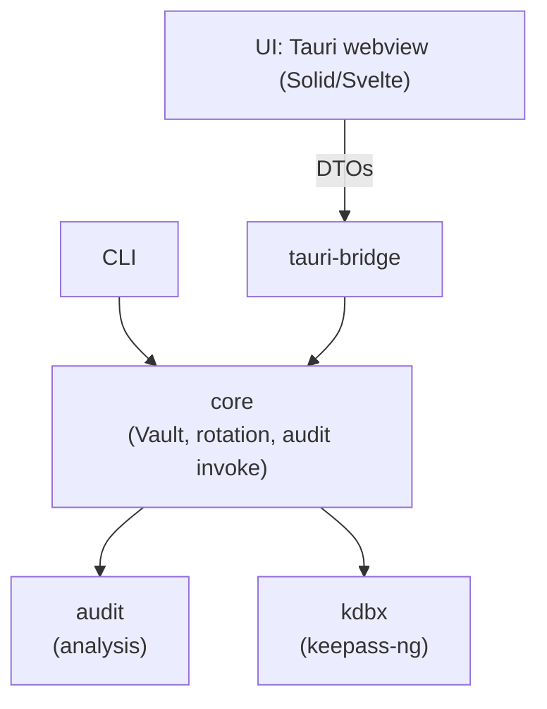

# freekee - Design Document

## 1. Overview

`freekee` is a cross-platform password manager built on the standard KeePass KDBX4 file format. It targets Linux, macOS, Windows, iOS, and Android from a single Rust core via Tauri 2, plus a standalone CLI binary.

The motivating use case: an existing user of KeePassXC (Linux) and Strongbox (iOS) syncing a `.kdbx` via Dropbox, who wants better tooling - particularly first-class key rotation and a confidence check that their database is configured to be safe against current and emerging threats.

freekee writes only standard KDBX4. Files written by freekee can be opened, edited, and saved by KeePassXC, Strongbox, KeePassDX, and any other KeePass client without conversion or data loss. We are not creating a new format.

## 2. Goals

- **Strict KDBX4 compatibility**: any database written by KeePassXC 2.7+ can be imported and round-tripped without loss; any freekee database is a valid KDBX4 file.
- **First-class rotation as a CLI primitive**: passphrase rotation, KDF parameter rotation, cipher rotation, keyfile rotation, and bulk entry-password rotation are all explicit commands.
- **Post-quantum-aware audit**: scan a database, report weak configurations, and provide remediation commands. Treat PQ readiness as a configuration-hygiene problem, not a format problem.
- **Cross-platform from one codebase**: Rust core shared across CLI, desktop, and mobile.
- **Local-first**, file-based, with no mandatory server. Dropbox, iCloud Files, Syncthing, etc. work via standard file I/O.
- **Auditable**: pinned dependencies, fuzzed parsers, lossless round-trip enforcement.

## 3. Non-goals

- Custom file format. We use standard KDBX4.
- Custom cryptographic primitives. We rely on what KeePass already specifies.
- A post-quantum _envelope_ around KDBX. The threat model does not justify it (see section 4.2).
- Browser autofill in v1 (post-v1 milestone).
- iOS AutoFill extension in v0.1 (deferred to v0.2).
- Apple Watch, Android Wear (post-v1).
- Cloud-hosted vault service.
- Backwards compatibility with KDBX3.x or KDB1 for _writing_. Read-only import (with an offer to upgrade to KDBX4) is acceptable.

## 4. Threat model

### 4.1 In scope

- Adversary obtains the encrypted file (Dropbox breach, stolen laptop, evil maid).
- Adversary obtains an old version of the file after a rotation and tries to use it.
- Adversary modifies the file in transit and we open the result.
- A future adversary with a cryptographically relevant quantum computer applies known quantum algorithms (Grover, Shor) to a stolen file.
- User is unaware their database is on a weak configuration (e.g., AES-128, AES-KDF, weak Argon2 parameters). The audit feature exists for this case.

### 4.2 Quantum threats - and why no envelope

KDBX4 at-rest encryption is symmetric throughout. There is no public-key cryptography in the KDBX4 file format itself.

- **Shor's algorithm** breaks RSA, DH, and ECC. KDBX4 uses none of these. Not applicable.
- **Grover's algorithm** offers a quadratic speedup against symmetric ciphers and hashes. Effective security:
  - AES-256 -> ~128 bits PQ. Comfortable.
  - AES-128 -> ~64 bits PQ. **Not safe.** Audit must flag.
  - ChaCha20 -> ~128 bits PQ (256-bit key). Comfortable.
  - SHA-256 -> ~128 bits collision PQ. Comfortable.
- **Argon2id** is memory-hard. Grover provides limited benefit; the bottleneck is memory bandwidth, not gate count. Strong parameters remain strong.

Conclusion: **a properly configured KDBX4 file is post-quantum-secure at rest under current cryptographic understanding.** The right intervention is _configuration audit_, not a new format. This is the central design call.

Caveat for the threat model: this assumes Grover-on-symmetric is the dominant quantum threat. If novel quantum (or classical) attacks against AES, ChaCha20, or Argon2 emerge, we update the audit rules.

### 4.3 Out of scope

- Compromise of the host OS at runtime (keylogger, memory scraping). We zeroize where practical but do not claim defense against a privileged attacker on the unlocked machine.
- Physical hardware attacks (cold boot, fault injection, EM analysis).
- Coercion / rubber-hose. No plausible deniability or duress passwords in v1.
- Supply chain attacks against dependencies (mitigated procedurally via `cargo audit`, pinning, `cargo deny`).

### 4.4 Assumed properties

- The user's passphrase has at least 60 bits of entropy (audit warns if zxcvbn-style estimator says otherwise).
- The host OS provides a working CSPRNG via `getrandom`.
- Argon2id parameters are auto-tuned per-platform on `init` and stored in the file.

## 5. Architecture



Isolation rules:

- `kdbx` has all KDBX awareness. Wraps `keepass-ng` behind a stable trait so upstream churn doesn't ripple.
- `audit` is pure analysis. Input: parsed database + audit config. Output: findings list. No I/O, no mutation.
- `core` is the only place these are composed. Owns rotation logic, save/load orchestration, file locking, conflict detection.
- `cli` and `tauri-bridge` are presentation layers; no business logic.

## 6. The KDBX layer

The single biggest implementation risk is that `keepass-ng` (and its predecessor `keepass-rs`) drops unknown XML fields when writing. Mitigation:

1. **Compatibility fixture suite** in `tests/roundtrip/`. Generate KDBX databases in KeePassXC covering every feature (groups, entries, history, attachments, custom icons, custom data fields, auto-type associations, expiry, tags, deleted-objects). For each fixture: read with our code, write with our code, read again, assert equivalence at the parsed-tree level (modulo timestamps).
2. **Round-trip mode in CI**: Linux job runs the KeePassXC CLI to verify that files we wrote can be re-read by KeePassXC.
3. **Upstream fixes**: any data loss is a bug to fix in our `kdbx` crate or to upstream into `keepass-ng`. Worst case: maintain a fork.
4. **Compatibility matrix doc** (`docs/kdbx-compat-matrix.md`) lists what we do and do not support, updated per release.

The `kdbx` crate exposes a stable trait (`KdbxStore`) that hides `keepass-ng` specifics. If we have to fork or replace the underlying parser, the rest of the codebase doesn't notice.

## 7. The audit layer

The audit crate is freekee's headline differentiator. It takes a parsed database (and optional config: HIBP opt-in, strictness level) and returns a list of `Finding` values, each with severity, category, message, citation, and a structured remediation suggestion.

### 7.1 Finding categories

**Cipher / format:**

- `weak-outer-cipher`: outer cipher is AES-128. Severity: high. Cite NIST PQC guidance on Grover.
- `legacy-stream-cipher`: inner stream cipher is Salsa20 or ARC4. Severity: medium. Recommend ChaCha20.
- `legacy-kdf`: KDF is AES-KDF. Severity: high. Recommend Argon2id.
- `weak-argon2-params`: memory < 64 MiB, iterations < 2, or parallelism < 2. Severity: medium. Recommend tuned defaults.
- `legacy-kdbx-version`: file is KDBX 3.x. Severity: medium. Recommend upgrade to 4.x.

**Composite key:**

- `weak-passphrase`: zxcvbn estimate < 60 bits. Severity: high. Note: `zxcvbn-rs` 3.1.1 caps `guesses_log10` at ~19.27 (~=64 bits), so this threshold is the practical ceiling - anything stricter cannot be expressed with the current estimator.
- `passphrase-only`: no keyfile, no HMAC challenge. Severity: low (informational).

**Entries:**

- `weak-entry-password`: zxcvbn < 50 bits. Severity: medium per entry.
- `reused-password`: same password across multiple entries. Severity: medium.
- `stale-password`: not changed in > 180 days (configurable). Severity: low.
- `breached-password`: HIBP k-anonymity API match. Severity: critical. **Opt-in only**, off by default.
- `expired-entry-overdue`: entry's `Expires` is in the past. Severity: low.

**Attachments:**

- `large-attachment`: > 5 MiB; informational, not a security issue.

### 7.2 Output contract

Every finding includes a `remediation` field with the exact CLI command that fixes it:

```
[HIGH] legacy-kdf
  Database uses AES-KDF for key derivation. Argon2id provides
  better resistance to GPU/ASIC attacks and is the current
  KeePass recommendation.
  Source: https://keepass.info/help/kb/kdbx_4.html
  Fix:    freekee rotate kdf path/to/db.kdbx --to argon2id
```

### 7.3 Audit is read-only

The audit crate never mutates a database. It reads, analyzes, returns findings. Mutations happen via separate `rotate` / `set` commands the user explicitly runs in response to findings. This keeps audit safe to run constantly (e.g., on every save in the GUI).

## 8. CLI interface

```bash
# Lifecycle
freekee init [path]
freekee info <path>                  # version, cipher, KDF, recipient summary
freekee verify <path>                # integrity check, no decrypt of payload

# Inspection
freekee ls <path> [pattern]
freekee get <path> <entry>
freekee history <path> <entry>

# Mutation
freekee set <path> <entry> [--gen-password] [--length N]
freekee rm <path> <entry>
freekee mv <path> <entry> <new-path>

# Audit (the differentiator)
freekee audit <path> [--strict] [--hibp] [--json]
freekee audit <path> --fix-interactive       # walk through findings, prompt to fix
freekee audit-watch <path>                   # re-audit on file change

# Rotation
freekee rotate passphrase <path>
freekee rotate kdf <path> --to argon2id
freekee rotate kdf-params <path> [--memory MIB] [--iterations N] [--parallelism P]
freekee rotate cipher <path> --to chacha20
freekee rotate kdbx-version <path> --to 4
freekee rotate keyfile <path> [--remove | --replace <new-keyfile>]
freekee rotate entry <path> <entry>          # regenerate single entry's password
freekee rotate entries <path> --where 'reused | stale | weak'
                                             # bulk-regenerate matching entries

# Sync hygiene
freekee diff <a> <b>
freekee merge <a> <b> -o <out> [--base <c>]
```

Conventions:

- Entry paths use `Group/Subgroup/EntryTitle`.
- Passphrases come from `$FREEKEE_PASS`, prompt, or stdin (`--pass-stdin`).
- Output is human-readable by default; `--json` emits machine format.
- No subcommand prints secret material unless explicitly requested (`get --show`).
- Every `rotate` command keeps a backup of the prior file at `<path>.freekee-bak-<timestamp>` unless `--no-backup` is passed.

## 9. Mobile / iOS considerations

Tauri 2 emits iOS targets from the same `app/src-tauri/` directory. The iOS-specific work breaks down as:

- **Keychain plugin** (`plugins/tauri-plugin-keychain/`): wraps `kSecClassGenericPassword` for storing the unlocked database key under biometric protection, optionally backed by Secure Enclave.
- **Biometric unlock**: official `tauri-plugin-biometric` covers Face ID / Touch ID.
- **File access**: use the iOS Files app file picker via `tauri-plugin-dialog`. User picks the `.kdbx` from Dropbox's File Provider. We do not bundle a Dropbox SDK.
- **AutoFill**: deferred. Requires a separate iOS extension target that Tauri's generator does not scaffold. v0.2.
- **Background lock**: re-lock on app backgrounding. No "stay unlocked" option in v0.1.

Android equivalents: Keystore, BiometricPrompt, Storage Access Framework. Largely parallel.

Known friction: developing on a physical iOS device requires Xcode open with the device connected, and the dev server must bind to the TUN address Tauri provides. Document this in `docs/ios-dev.md`.

## 10. Testing strategy

- **Unit tests** colocated with code in each crate.
- **Integration tests** in `tests/` per crate.
- **Property tests** (`proptest`) for round-trip: `parse(write(parse(file))) == parse(file)` for any KDBX4 fixture.
- **Roundtrip fixtures**: KeePassXC-generated databases under `tests/roundtrip/fixtures/`. Each fixture has a `.kdbx` and an `expected.json` describing its parsed structure. Tests assert (a) we can read it, (b) we can write it back, (c) KeePassXC can read what we wrote - the third via a `keepassxc-cli` invocation in CI.
- **Audit golden tests**: a fixture database with known weaknesses -> asserted findings list. Adding a rule = adding a golden file.
- **Fuzzing** (`cargo-fuzz` + libFuzzer): KDBX parser. Corpus checked in (or via git-lfs).
- **Negative tests**: tampered ciphertext fails, truncated header fails parse, malformed XML rejected, etc.
- **Secret-leakage meta-test**: runs the CLI with a known plaintext, captures stdout/stderr, grep's for the plaintext. Fails if found.

## 11. Phasing

| Milestone | Scope                                                                                                                                                   |
| --------- | ------------------------------------------------------------------------------------------------------------------------------------------------------- |
| v0.1.0    | CLI + Linux desktop GUI. `kdbx`, `audit`, `core`, `cli`, `tauri-bridge`, desktop app. All audit rules. All rotation commands. Roundtrip fixtures green. |
| v0.2.0    | iOS app: Keychain plugin, biometric unlock, Files-app picker. macOS + Windows desktop builds.                                                           |
| v0.3.0    | iOS AutoFill extension. Android app.                                                                                                                    |
| v0.4.0    | Browser extension (separate repo, talks to native messaging host).                                                                                      |
| v1.0.0    | Stable interface frozen, security review completed, packaged binaries for all targets, audit ruleset published as a versioned spec.                     |

Suggested calendar: v0.1 in 6-8 weeks of focused work (faster than the prior plan since there's no envelope crate); v0.2 another 4-6.

## 12. Open questions

- **Audit ruleset versioning**: as we add rules, existing files might suddenly start failing audits. Should rules be versioned (`--ruleset 1`) so users can pin? Lean: yes for v1.0, no for v0.x.
- **HIBP opt-in UX**: how loud should the prompt be? Lean: prompted once on first audit, decision stored in OS-level config (not in the database).
- **Frontend framework**: Solid vs. Svelte. Pick during week 4. Constraint: must work in Tauri's webview on iOS.
- **Conflict resolution UX for `merge`**: field-level three-way merge vs. newest-wins. Decide when we get there.
- **Telemetry**: none. Documented here so it stays not-open.

## 13. References

- [KDBX 4 file format spec](https://keepass.info/help/kb/kdbx_4.html)
- [KDBX 4.1 changes](https://keepass.info/help/kb/kdbx_4.1.html)
- [Unofficial KDBX4 spec (seaofmars)](https://github.com/seaofmars/KDBX4-Spec)
- [Documenting KeePass KDBX4 file format (Palant)](https://palant.info/2023/03/29/documenting-keepass-kdbx4-file-format/)
- [keepass-ng on docs.rs](https://docs.rs/keepass-ng)
- [Tauri 2 mobile guide](https://v2.tauri.app/develop/)
- [NIST IR 8105: Report on Post-Quantum Cryptography](https://csrc.nist.gov/publications/detail/nistir/8105/final)
- [Have I Been Pwned k-Anonymity API](https://haveibeenpwned.com/API/v3#PwnedPasswords)

## 14. Glossary

- **KDBX4**: KeePass database format v4, introduced in KeePass 2.35.
- **Argon2id**: memory-hard password hashing function, current KeePass recommended KDF.
- **AES-KDF**: legacy KDBX key derivation; just iterated AES. Discouraged.
- **HNDL**: Harvest Now, Decrypt Later - the threat that a stored ciphertext today might be cracked by a future attacker with new capabilities.
- **HIBP**: Have I Been Pwned, the breached-password lookup service. Uses k-anonymity so the full password never leaves the client.
- **Composite key**: KeePass's term for the combination of passphrase + keyfile + hardware HMAC that unlocks a database.
